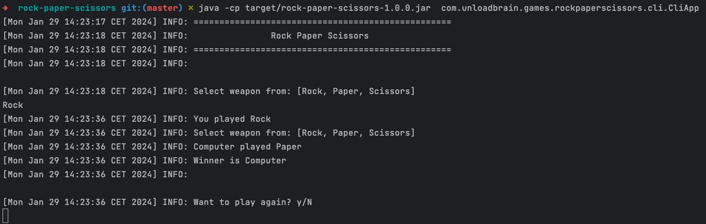

# Rock Paper Scissors

Play **Rock Paper Scissors** and **Rock Paper Scissors Lizard Spock** from your terminal.



### Features
- Play with more than two player.
- Add more custom weapon.
- Add / remove rules.

### How to run

###### Prerequisite 
- JDK 1.8 (Tested with Oracle JDK)
- Maven 3.x+

###### Build
```
$ mvn clean compile install
```

###### Run
```
 java -jar rock-paper-scissors-cli-app/target/rock-paper-scissors-cli-app-1.0.0-jar-with-dependencies.jar

```

### Development
##### How to run tests

###### How to run unit tests
To run the unit tests, execute the following commands
```
mvn clean test-compile test
```

###### How to run integration tests
To run the integration tests, execute the following commands
```
mvn clean test-compile verify -DskipTests=true
```

###### How to run both unit tests and integration tests
To run the integration tests, execute the following commands
```
mvn clean test-compile verify
```

###### How to run pitest
To run the mutation tests, execute the following commands
```
mvn clean test-compile test
mvn org.pitest:pitest-maven:mutationCoverage
```

### Improvements to make
- Cover more unit tests and ITs cases.
- Add web module to play on web.
- Generate and check OWASP report.
- Add logging.
